# ATC AI Event Agent Lab

A comprehensive demonstration of how to build AI agents that connect to multiple Model Context Protocol (MCP) services using Google's Agent Development Kit (ADK).

## 📚 Overview

This project showcases a modern architecture pattern for building intelligent AI systems:

- **MCP Services**: Specialized microservices that expose tools and capabilities via the Model Context Protocol
- **AI Agents**: Google ADK agents that orchestrate multiple MCP services to accomplish complex tasks
- **Live Example**: A real-world trend discovery system with three MCP services feeding into an intelligent agent

### What You'll Learn

This lab teaches you how to:
1. Create specialized MCP services that expose AI tools
2. Build AI agents that consume MCP services as toolsets
3. Orchestrate complex workflows across multiple services
4. Deploy and run the complete system

## 🏗️ Architecture

### System Architecture Overview

```mermaid
graph TB
    User["👤 User/Client"]
    Agent["🤖 Trending Alert Agent<br/>(Google ADK)"]
    
    TrendScout["📊 TrendScout MCP<br/>Port 8001<br/>Trend Detection"]
    ProductDetails["📋 Product Details MCP<br/>Port 8003<br/>Specifications"]
    ProductSites["🛒 Product Sites MCP<br/>Port 8002<br/>Pricing & Deals"]
    
    GoogleAPI["🔌 Google APIs<br/>Gemini, Search"]
    
    User -->|Interactive Input| Agent
    
    Agent -->|Tool: get_todays_product_trends| TrendScout
    Agent -->|Tool: get_product_details| ProductDetails
    Agent -->|Tool: get_todays_deals_for_product| ProductSites
    
    TrendScout -->|Calls| GoogleAPI
    ProductDetails -->|Calls| GoogleAPI
    ProductSites -->|Calls| GoogleAPI
    
    GoogleAPI -->|Responses| TrendScout
    GoogleAPI -->|Responses| ProductDetails
    GoogleAPI -->|Responses| ProductSites
    
    TrendScout -->|SSE Stream| Agent
    ProductDetails -->|SSE Stream| Agent
    ProductSites -->|SSE Stream| Agent
    
    Agent -->|Synthesized Response| User
```



### Data Flow: From User Query to Response

```mermaid
sequenceDiagram
    participant User as 👤 User
    participant Agent as 🤖 Agent
    participant TrendMCP as 📊 Trend MCP
    participant DetailsMCP as 📋 Details MCP
    participant SitesMCP as 🛒 Sites MCP
    participant GoogleAPI as 🔌 Google APIs

    User->>Agent: What's trending?
    Agent->>TrendMCP: get_todays_product_trends()
    TrendMCP->>GoogleAPI: Search for trends
    GoogleAPI-->>TrendMCP: Trending data
    TrendMCP-->>Agent: Product name + signals
    
    Agent->>DetailsMCP: get_product_details(product)
    DetailsMCP->>GoogleAPI: Search for specs
    GoogleAPI-->>DetailsMCP: Product specs
    DetailsMCP-->>Agent: Detailed analysis
    
    Agent->>SitesMCP: get_todays_deals_for_product(product)
    SitesMCP->>GoogleAPI: Search for pricing
    GoogleAPI-->>SitesMCP: Pricing data
    SitesMCP-->>Agent: Retailer offers
    
    Agent->>Agent: Synthesize all data
    Agent-->>User: Complete response
```



### Component Relationship Diagram


## 📁 Project Structure

```
atcieventagenticlab/
├── README.md                          # This file
│
├── mcp_trendscout/                    # MCP Service #1: Trend Detection
│   ├── mcp_trendsscout_server.py     # Server implementation
│   ├── requirements.txt               # Dependencies
│   ├── README.md                      # Service documentation
│   └── agent/
│       └── trends_scout_agent.py      # LLM agent configuration
│
├── mcp_productdetails/                # MCP Service #2: Product Analysis
│   ├── mcp_productdetails_server.py  # Server implementation
│   ├── requirements.txt               # Dependencies
│   ├── README.md                      # Service documentation
│   └── agent/
│       └── productdetails_agent.py    # LLM agent configuration
│
├── mcp_productsites/                  # MCP Service #3: Pricing & Deals
│   ├── mcp_productsites_server.py    # Server implementation
│   ├── requirements.txt               # Dependencies
│   ├── README.md                      # Service documentation
│   └── agent/
│       └── productsites_agent.py      # LLM agent configuration
│
└── trendagent/                        # Main Agent: Orchestrates all services
    ├── trend_agent.py                 # Agent implementation
    ├── requirements.txt               # Dependencies
    └── README.md                      # Agent documentation
```

## 🎯 Quick Start

### 1. Complete System Setup (5-10 minutes)

```bash
# Clone or navigate to the project
cd atcieventagenticlab

# Setup and run MCP Service 1 (Terminal 1)
cd mcp_trendscout
python -m venv venv
.\venv\Scripts\Activate.ps1  # Windows
# source venv/bin/activate  # macOS/Linux
pip install -r requirements.txt
echo "GOOGLE_API_KEY=your_api_key_here" > .env
python mcp_trendsscout_server.py
# Output: 🌐 MCP SSE Server: http://127.0.0.1:8001/sse
```

```bash
# Setup and run MCP Service 2 (Terminal 2)
cd mcp_productdetails
python -m venv venv
.\venv\Scripts\Activate.ps1  # Windows
# source venv/bin/activate  # macOS/Linux
pip install -r requirements.txt
echo "GOOGLE_API_KEY=your_api_key_here" > .env
python mcp_productdetails_server.py
# Output: 🌐 MCP SSE Server: http://127.0.0.1:8003/sse
```

```bash
# Setup and run MCP Service 3 (Terminal 3)
cd mcp_productsites
python -m venv venv
.\venv\Scripts\Activate.ps1  # Windows
# source venv/bin/activate  # macOS/Linux
pip install -r requirements.txt
echo "GOOGLE_API_KEY=your_api_key_here" > .env
python mcp_productsites_server.py
# Output: 🌐 MCP SSE Server: http://127.0.0.1:8002/sse
```

```bash
# Setup and run the Agent (Terminal 4)
cd trendagent
python -m venv venv
.\venv\Scripts\Activate.ps1  # Windows
# source venv/bin/activate  # macOS/Linux
pip install -r requirements.txt
python trend_agent.py
# Now interact with the agent!
```

### 2. Test the System

```
👤 You: What's trending today?
⏳ Processing...
🤖 Assistant: [Agent retrieves trends and provides comprehensive response]

👤 You: Where can I buy it?
⏳ Processing...
🤖 Assistant: [Agent finds pricing and retailers]

👤 You: quit
👋 Goodbye!
```

## 📖 Developer Guide

### Part 1: Understanding MCP Services

An MCP Service is a specialized microservice that:
- Runs on its own port (SSE-based server)
- Exposes specific tools/capabilities to clients
- Uses an internal LLM agent to implement those capabilities
- Communicates via Server-Sent Events (SSE)

#### Key Components of an MCP Service

```
┌─────────────────────────────────────┐
│       MCP Service Structure          │
├─────────────────────────────────────┤
│                                     │
│  ┌──────────────────────────────┐  │
│  │   FastMCP Server             │  │
│  │  (HTTP + SSE Transport)      │  │
│  │  Port: 8001-8003             │  │
│  └─────────────┬────────────────┘  │
│                │                    │
│  ┌─────────────▼────────────────┐  │
│  │   Tool Endpoints             │  │
│  │  @mcp.tool()                 │  │
│  │  async def my_tool(): ...    │  │
│  └─────────────┬────────────────┘  │
│                │                    │
│  ┌─────────────▼────────────────┐  │
│  │   Internal LLM Agent         │  │
│  │  (google.adk.agents)         │  │
│  │  - model: gemini-2.x         │  │
│  │  - tools: google_search, etc │  │
│  │  - instruction: task prompt  │  │
│  └──────────────────────────────┘  │
│                │                    │
│  ┌─────────────▼────────────────┐  │
│  │   Google APIs                │  │
│  │  - Gemini LLM                │  │
│  │  - Google Search             │  │
│  └──────────────────────────────┘  │
│                                     │
└─────────────────────────────────────┘
```

### Part 2: Creating Your First MCP Service

#### Step 1: Create the Project Structure

```bash
mkdir my_mcp_service
cd my_mcp_service

# Create subdirectories
mkdir agent

# Create required files
touch mcp_service_server.py
touch requirements.txt
touch .env
```

#### Step 2: Define Requirements

**requirements.txt**:
```
fastmcp>=2.0.0
httpx>=0.27.0
google-adk==1.20.0
python-dotenv>=1.0.0
google-genai
pydantic
```

#### Step 3: Create an Internal LLM Agent

**agent/my_agent.py**:
```python
from google.adk.agents import LlmAgent
from google.adk.tools import google_search

# Create an LLM agent with specific capabilities
my_agent = LlmAgent(
    name="my_specialized_agent",
    model="gemini-2.0-flash",
    description="A specialized agent for [your specific task]",
    instruction="""You are a specialized assistant for [specific purpose].
    
    ### GOAL
    [Define what this agent should accomplish]
    
    ### OPERATIONAL PROTOCOL
    1. [Step 1]
    2. [Step 2]
    3. [Step 3]
    
    ### OUTPUT FORMAT
    [Specify how responses should be formatted]""",
    tools=[google_search]  # Add tools as needed
)
```

#### Step 4: Create the MCP Server

**mcp_service_server.py**:
```python
from fastmcp import FastMCP
import agent.my_agent as my_agent_module
import asyncio
from dotenv import load_dotenv
from google.adk.agents import Agent
from google.adk.runners import Runner
from google.adk.sessions import InMemorySessionService
from google.genai import types

# Initialize
load_dotenv()
mcp = FastMCP("My Custom MCP Service")

session_service = InMemorySessionService()
agent: Agent = my_agent_module.my_agent
app_name = "my_service_app"

# Define your async tool implementation
async def _my_tool_implementation(param: str) -> str:
    """Internal implementation of your tool"""
    runner = Runner(
        app_name=app_name,
        agent=agent,
        session_service=session_service,
    )

    session = await session_service.create_session(
        state={},
        app_name=app_name,
        user_id="user1"
    )
    
    content = types.Content(
        role="user",
        parts=[types.Part(text=f"process this: {param}")],
    )

    events_async = runner.run_async(
        session_id=session.id,
        user_id=session.user_id,
        new_message=content
    )
    
    result = ""
    async for event in events_async:
        if event.is_final_response():
            result = event.content.parts[0].text
    
    return result

# Expose the tool via MCP
@mcp.tool()
async def my_tool(param: str) -> str:
    """Description of what this tool does"""
    return await _my_tool_implementation(param)

# Server startup
if __name__ == "__main__":
    print("🌐 MCP Service running on http://127.0.0.1:8000/sse")
    mcp.run(transport="sse", host="0.0.0.0", port=8000)
```

#### Step 5: Configure Environment

**.env**:
```
GOOGLE_API_KEY=your_google_api_key_here
```

#### Step 6: Install and Run

```bash
python -m venv venv
.\venv\Scripts\Activate.ps1
pip install -r requirements.txt
python mcp_service_server.py
# Output: 🌐 MCP Service running on http://127.0.0.1:8000/sse
```

### Part 3: Creating an Agent That Uses MCP Services

#### Step 1: Create Agent Project Structure

```bash
mkdir my_agent
cd my_agent
touch trend_agent.py
touch requirements.txt
```

#### Step 2: Define Requirements

**requirements.txt**:
```
httpx>=0.27.0
google-adk==1.20.0
python-dotenv>=1.0.0
```

#### Step 3: Create the Agent

**trend_agent.py**:
```python
import asyncio
from dotenv import load_dotenv
from google.adk.agents import Agent
from google.adk.runners import Runner
from google.adk.sessions import InMemorySessionService
from google.adk.tools.mcp_tool import McpToolset
from google.adk.tools.mcp_tool.mcp_session_manager import SseConnectionParams
from google.genai import types

load_dotenv()

# Define MCP service URLs
MCP_SERVICE_1_URL = "http://127.0.0.1:8001/sse"
MCP_SERVICE_2_URL = "http://127.0.0.1:8002/sse"

async def main():
    # Initialize session service
    session_service = InMemorySessionService()
    
    session = await session_service.create_session(
        state={},
        app_name="my_agent_app",
        user_id="user1"
    )

    # Connect to MCP services as toolsets
    mcp_toolset_1 = McpToolset(
        connection_params=SseConnectionParams(url=MCP_SERVICE_1_URL)
    )
    
    mcp_toolset_2 = McpToolset(
        connection_params=SseConnectionParams(url=MCP_SERVICE_2_URL)
    )
    
    # Create agent with MCP toolsets
    agent = Agent(
        name="my_agent",
        model="gemini-2.0-flash",
        description="An agent that coordinates multiple MCP services",
        instruction="""You are a helpful assistant that uses multiple specialized services.
            Use the tools from Service 1 for [task 1].
            Use the tools from Service 2 for [task 2].
            Synthesize results from both services.""",
        tools=[mcp_toolset_1, mcp_toolset_2],  # Add MCP toolsets
    )
    
    # Create runner
    runner = Runner(
        app_name="my_agent_app",
        agent=agent,
        session_service=session_service,
    )

    print("🤖 My Agent with MCP Services")
    print("📡 Connected to multiple MCP services")
    print("Type 'quit' to exit\n")
    
    # Interactive loop
    while True:
        user_input = input("👤 You: ").strip()
        if user_input.lower() in ["quit", "exit", "q"]:
            break
        if not user_input:
            continue
        
        content = types.Content(
            role="user",
            parts=[types.Part(text=user_input)]
        )
        
        print("⏳ Processing...")
        
        events = runner.run_async(
            session_id=session.id,
            user_id=session.user_id,
            new_message=content
        )
        
        async for event in events:
            if hasattr(event, "content") and event.content:
                for part in event.content.parts:
                    if hasattr(part, "text") and part.text:
                        print(f"🤖 Assistant: {part.text}\n")
    
    # Cleanup
    await mcp_toolset_1.close()
    await mcp_toolset_2.close()
    await session_service.close()
    print("👋 Goodbye!")

if __name__ == "__main__":
    asyncio.run(main())
```

#### Step 4: Run Your Agent

```bash
python -m venv venv
.\venv\Scripts\Activate.ps1
pip install -r requirements.txt
python trend_agent.py
```

## 🔌 Key Concepts

### McpToolset

McpToolset is the bridge between your agent and MCP services:

```python
from google.adk.tools.mcp_tool import McpToolset
from google.adk.tools.mcp_tool.mcp_session_manager import SseConnectionParams

# Connect to a service
toolset = McpToolset(
    connection_params=SseConnectionParams(
        url="http://127.0.0.1:8001/sse"  # Service URL
    )
)

# Use in agent
agent = Agent(
    tools=[toolset]  # Toolset exposes all MCP service tools
)
```

### SseConnectionParams

Configuration for connecting to MCP services:

```python
params = SseConnectionParams(
    url="http://127.0.0.1:8001/sse"  # Full SSE endpoint URL
)
```

### FastMCP Server

Framework for creating MCP services:

```python
from fastmcp import FastMCP

mcp = FastMCP("Service Name")

@mcp.tool()
async def my_tool(param: str) -> str:
    """Tool description"""
    return "result"

# Start server
mcp.run(transport="sse", host="0.0.0.0", port=8001)
```

## 📋 Reference Implementation

This project includes a complete, working example. See individual READMEs:

| Service | File | Purpose |
|---------|------|---------|
| [TrendScout MCP](mcp_trendscout/README.md) | `mcp_trendscout_server.py` | Identify trending products |
| [Product Details MCP](mcp_productdetails/README.md) | `mcp_productdetails_server.py` | Get product specifications |
| [Product Sites MCP](mcp_productsites/README.md) | `mcp_productsites_server.py` | Find pricing and deals |
| [Trending Alert Agent](trendagent/README.md) | `trend_agent.py` | Orchestrates all services |

## 🚀 Next Steps

### Learning Path

1. **Understand the Architecture**
   - Review the system diagrams above
   - Read [Trending Alert Agent README](trendagent/README.md)
   - Run the complete example system

2. **Create Your First MCP Service**
   - Follow Part 2 of Developer Guide above
   - Create a simple service that uses Google Search
   - Test it with a client (curl or Python)

3. **Create an Agent Using Your Service**
   - Follow Part 3 of Developer Guide above
   - Create an agent that connects to your MCP service
   - Test with interactive queries

4. **Add Multiple Services**
   - Create 2-3 complementary MCP services
   - Build an agent that orchestrates them
   - Implement complex workflows

### Extension Ideas

- **Add Persistence**: Use a database instead of in-memory sessions
- **Multi-User**: Implement user authentication and session management
- **Caching**: Cache MCP service responses to improve performance
- **Monitoring**: Add logging and metrics to MCP services
- **Deployment**: Deploy services to cloud platforms (Google Cloud, AWS, Azure)
- **Advanced Routing**: Implement intelligent tool selection based on context

## 🛠️ Technology Stack

| Component | Technology | Version |
|-----------|-----------|---------|
| **MCP Framework** | FastMCP | >=2.0.0 |
| **Agent SDK** | Google ADK | 1.20.0 |
| **LLM Model** | Google Gemini | 2.0-Flash / 2.5-Pro |
| **Transport** | Server-Sent Events (SSE) | HTTP/1.1 |
| **Language** | Python | 3.8+ |
| **Runtime** | asyncio | Python built-in |

## 📚 Resources

### Official Documentation
- [Google ADK Documentation](https://adk-docs.example.com)
- [FastMCP Documentation](https://fastmcp.readthedocs.io)
- [Model Context Protocol Specification](https://modelcontextprotocol.io)
- [Google Gemini API](https://ai.google.dev)

### Related Concepts
- **Model Context Protocol (MCP)**: Standard for connecting AI systems with tools
- **Server-Sent Events (SSE)**: Efficient streaming protocol for real-time communication
- **Google ADK**: Framework for building agent-based applications
- **LLM Agents**: AI systems that can decide which tools to use for tasks

## 🐛 Troubleshooting

### Common Issues

**Port Already in Use**
```powershell
# Find process using port
Get-NetTCPConnection -LocalPort 8001

# Kill process
Stop-Process -Id <PID> -Force

# Or use a different port in the service
```

**API Key Invalid**
```bash
# Verify API key in each service's .env
cat .env | grep GOOGLE_API_KEY

# Get new key from Google AI Studio
# https://aistudio.google.com/app/apikey
```

**Connection Refused**
```bash
# Ensure all services are running on expected ports
# Check service startup logs
# Verify firewall rules
```

**Module Import Errors**
```bash
# Reinstall requirements
pip install -r requirements.txt --force-reinstall

# Verify installation
pip list | grep google-adk
```

## 📞 Support

For issues with:
- **Individual MCP Services**: See their respective README files
- **Main Agent**: See [trendagent/README.md](trendagent/README.md)
- **Architecture/Design**: Review diagrams and guides in this README
- **Google ADK**: Refer to [Google ADK documentation](https://adk-docs.example.com)

## 📄 License

This project is part of the ATC AI Event Agent Lab.

## 🎓 Learning Outcomes

After completing this lab, you should understand:

✅ How MCP services expose tools to AI agents
✅ How agents discover and use multiple MCP services
✅ How to build specialized microservices for AI tasks
✅ How to orchestrate complex workflows across services
✅ How to structure code for scalability and maintainability
✅ Best practices for agent-based system design

## 🎬 Getting Started Flowchart

```mermaid
flowchart TD
    A["Start: You want to build an AI agent system"] 
    B{"Do you want to create<br/>MCP Services?"}
    C["Follow Part 2 Developer Guide<br/>Create MCP Services"]
    D{"Do you have MCP Services<br/>to connect to?"}
    E["Follow Part 3 Developer Guide<br/>Create an Agent"]
    F["Run all services in separate terminals"]
    G["Run your agent in another terminal"]
    H["Test your complete system"]
    I["Celebrate! 🎉"]
    
    A --> B
    B -->|Yes| C
    C --> D
    B -->|No| D
    D -->|Use Example Services| F
    D -->|Create Your Own| C
    C --> D
    D -->|Yes| E
    E --> F
    F --> G
    G --> H
    H -->|Success| I
    H -->|Issues| A
```



---

**Happy Building!** 🚀 Start with the [Quick Start](#-quick-start) section above or jump into Part 1 of the [Developer Guide](#-developer-guide).
